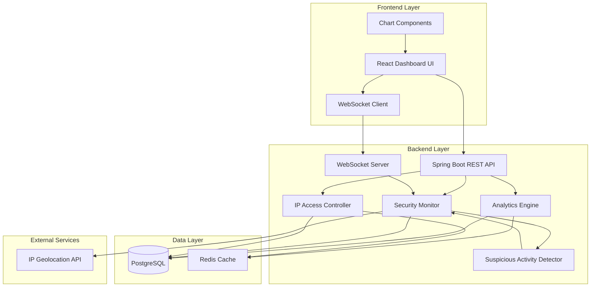
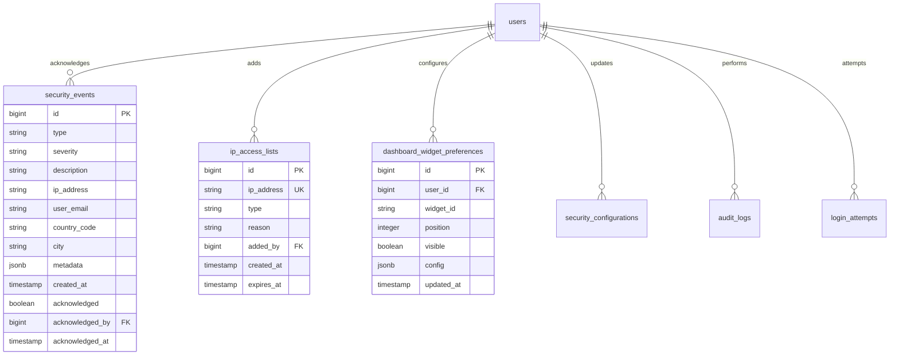

# Design Document: Enhanced Admin Dashboard

## Overview

The Enhanced Admin Dashboard extends the existing AttendEase admin interface with comprehensive analytics visualization and security monitoring capabilities. This design builds upon the current Spring Boot backend architecture, React/TypeScript frontend, and PostgreSQL database infrastructure.

### Core Capabilities

1. **Analytics Visualization**: Interactive charts and graphs displaying user statistics, course metrics, and system activity trends over configurable time ranges
2. **Security Monitoring**: Real-time tracking of login attempts, failed authentication detection, IP-based access control, and suspicious activity pattern recognition
3. **Real-Time Notifications**: WebSocket-based alert system delivering security events to active administrators within 5 seconds
4. **Customizable Dashboard**: Widget-based layout system with drag-and-drop reordering and persistent user preferences
5. **Data Export**: CSV and JSON export functionality for analytics and security data
6. **IP Geolocation**: Integration with external geolocation services to map IP addresses to geographic locations

### Design Principles

- **Performance First**: Aggressive caching, database indexing, and pagination to ensure sub-2-second response times
- **Security by Default**: All endpoints require admin authentication, comprehensive audit logging, and secure credential management
- **Graceful Degradation**: Individual widget failures don't crash the dashboard; geolocation service unavailability doesn't block core functionality
- **Responsive Design**: Mobile-first approach with adaptive layouts for screens from 320px to 4K displays
- **Accessibility**: WCAG 2.1 Level AA compliance with keyboard navigation and screen reader support

## Architecture

### High-Level Architecture



### Component Responsibilities

#### Frontend Components

**DashboardContainer**: Root component managing layout, widget state, and WebSocket connections
- Establishes WebSocket connection on mount
- Manages widget visibility and ordering
- Persists layout preferences to backend
- Handles global error boundaries

**AnalyticsWidget**: Reusable widget component for displaying analytics charts
- Fetches data from analytics endpoints
- Renders charts using Recharts library
- Implements auto-refresh every 30 seconds
- Provides export functionality

**SecurityDashboard**: Dedicated view for security monitoring
- Displays real-time security event feed
- Shows geographic map of login attempts
- Provides IP blocklist/whitelist management
- Filters events by severity, type, and date range

**NotificationManager**: Handles real-time notification display
- Receives WebSocket messages
- Displays toast notifications
- Manages notification badge count
- Persists read/unread status

#### Backend Services

**AnalyticsService**: Aggregates and computes statistical data
- Queries database with optimized indexes
- Implements caching with 5-minute TTL
- Computes trend percentages
- Determines appropriate time granularity

**SecurityMonitorService**: Monitors and analyzes security events
- Detects failed login patterns
- Identifies suspicious activity
- Creates security events
- Triggers alert notifications

**IPAccessControlService**: Manages IP-based access control
- Validates IP addresses and CIDR ranges
- Maintains in-memory cache of blocklist/whitelist
- Implements filter chain for request interception
- Supports IPv4 and IPv6

**SuspiciousActivityDetectorService**: Analyzes patterns for threats
- Runs scheduled analysis every 2 minutes
- Detects multi-country access patterns
- Identifies account enumeration attempts
- Flags rapid destructive actions

**GeolocationService**: Resolves IP addresses to locations
- Integrates with external geolocation API
- Implements 24-hour caching
- Handles rate limiting (100 req/min)
- Provides fallback for lookup failures

**WebSocketNotificationService**: Delivers real-time alerts
- Manages WebSocket sessions per administrator
- Broadcasts security events to connected clients
- Implements retry logic with exponential backoff
- Tracks notification delivery status

## Components and Interfaces

### Backend Entities

#### SecurityEvent Entity

```java
@Entity
@Table(name = "security_events")
public class SecurityEvent {
    @Id
    @GeneratedValue(strategy = GenerationType.IDENTITY)
    private Long id;
    
    @Column(nullable = false)
    @Enumerated(EnumType.STRING)
    private SecurityEventType type; // FAILED_LOGIN, BLOCKED_IP, SUSPICIOUS_ACTIVITY
    
    @Column(nullable = false)
    @Enumerated(EnumType.STRING)
    private SecurityEventSeverity severity; // LOW, MEDIUM, HIGH, CRITICAL
    
    @Column(nullable = false, length = 1000)
    private String description;
    
    @Column(name = "ip_address", length = 45)
    private String ipAddress;
    
    @Column(name = "user_email")
    private String userEmail;
    
    @Column(name = "country_code", length = 2)
    private String countryCode;
    
    @Column(name = "city")
    private String city;
    
    @JdbcTypeCode(SqlTypes.JSON)
    @Column(name = "metadata", columnDefinition = "jsonb")
    private Map<String, Object> metadata;
    
    @Column(name = "created_at", nullable = false)
    private LocalDateTime createdAt;
    
    @Column(name = "acknowledged")
    private Boolean acknowledged = false;
    
    @Column(name = "acknowledged_by")
    private Long acknowledgedBy;
    
    @Column(name = "acknowledged_at")
    private LocalDateTime acknowledgedAt;
}
```

#### IPAccessList Entity

```java
@Entity
@Table(name = "ip_access_lists")
public class IPAccessList {
    @Id
    @GeneratedValue(strategy = GenerationType.IDENTITY)
    private Long id;
    
    @Column(name = "ip_address", nullable = false, unique = true, length = 45)
    private String ipAddress;
    
    @Column(nullable = false)
    @Enumerated(EnumType.STRING)
    private IPAccessType type; // BLOCKLIST, WHITELIST
    
    @Column(length = 500)
    private String reason;
    
    @ManyToOne(fetch = FetchType.LAZY)
    @JoinColumn(name = "added_by")
    private User addedBy;
    
    @Column(name = "created_at", nullable = false)
    private LocalDateTime createdAt;
    
    @Column(name = "expires_at")
    private LocalDateTime expiresAt;
}
```

#### AnalyticsCache Entity

```java
@Entity
@Table(name = "analytics_cache")
public class AnalyticsCache {
    @Id
    @GeneratedValue(strategy = GenerationType.IDENTITY)
    private Long id;
    
    @Column(name = "cache_key", nullable = false, unique = true, length = 255)
    private String cacheKey;
    
    @JdbcTypeCode(SqlTypes.JSON)
    @Column(name = "cache_value", columnDefinition = "jsonb", nullable = false)
    private Map<String, Object> cacheValue;
    
    @Column(name = "created_at", nullable = false)
    private LocalDateTime createdAt;
    
    @Column(name = "expires_at", nullable = false)
    private LocalDateTime expiresAt;
}
```

#### IPGeolocationCache Entity

```java
@Entity
@Table(name = "ip_geolocation_cache")
public class IPGeolocationCache {
    @Id
    @GeneratedValue(strategy = GenerationType.IDENTITY)
    private Long id;
    
    @Column(name = "ip_address", nullable = false, unique = true, length = 45)
    private String ipAddress;
    
    @Column(name = "country_code", length = 2)
    private String countryCode;
    
    @Column(name = "country_name")
    private String countryName;
    
    @Column(name = "city")
    private String city;
    
    @Column(name = "latitude")
    private Double latitude;
    
    @Column(name = "longitude")
    private Double longitude;
    
    @Column(name = "cached_at", nullable = false)
    private LocalDateTime cachedAt;
    
    @Column(name = "expires_at", nullable = false)
    private LocalDateTime expiresAt;
}
```

#### DashboardWidgetPreference Entity

```java
@Entity
@Table(name = "dashboard_widget_preferences")
public class DashboardWidgetPreference {
    @Id
    @GeneratedValue(strategy = GenerationType.IDENTITY)
    private Long id;
    
    @ManyToOne(fetch = FetchType.LAZY)
    @JoinColumn(name = "user_id", nullable = false)
    private User user;
    
    @Column(name = "widget_id", nullable = false, length = 100)
    private String widgetId;
    
    @Column(name = "position", nullable = false)
    private Integer position;
    
    @Column(name = "visible", nullable = false)
    private Boolean visible = true;
    
    @JdbcTypeCode(SqlTypes.JSON)
    @Column(name = "config", columnDefinition = "jsonb")
    private Map<String, Object> config;
    
    @Column(name = "updated_at", nullable = false)
    private LocalDateTime updatedAt;
}
```

#### SecurityConfiguration Entity

```java
@Entity
@Table(name = "security_configurations")
public class SecurityConfiguration {
    @Id
    @GeneratedValue(strategy = GenerationType.IDENTITY)
    private Long id;
    
    @Column(name = "config_key", nullable = false, unique = true, length = 100)
    private String configKey;
    
    @Column(name = "config_value", nullable = false, length = 500)
    private String configValue;
    
    @Column(name = "description", length = 1000)
    private String description;
    
    @Column(name = "updated_by")
    private Long updatedBy;
    
    @Column(name = "updated_at", nullable = false)
    private LocalDateTime updatedAt;
}
```

### Backend DTOs

#### AnalyticsDataDto

```java
public class AnalyticsDataDto {
    private String metricName;
    private LocalDateTime timestamp;
    private Long value;
    private Double percentage;
    private String granularity; // HOURLY, DAILY, WEEKLY, MONTHLY
    private Map<String, Object> breakdown;
}
```

#### SecurityEventDto

```java
public class SecurityEventDto {
    private Long id;
    private String type;
    private String severity;
    private String description;
    private String ipAddress;
    private String userEmail;
    private String countryCode;
    private String city;
    private Map<String, Object> metadata;
    private LocalDateTime createdAt;
    private Boolean acknowledged;
    private Long acknowledgedBy;
    private LocalDateTime acknowledgedAt;
}
```

#### IPAccessListDto

```java
public class IPAccessListDto {
    private Long id;
    private String ipAddress;
    private String type;
    private String reason;
    private Long addedBy;
    private String addedByName;
    private LocalDateTime createdAt;
    private LocalDateTime expiresAt;
}
```

#### NotificationDto

```java
public class NotificationDto {
    private Long eventId;
    private String type;
    private String severity;
    private String message;
    private LocalDateTime timestamp;
    private Map<String, Object> data;
}
```

### REST API Endpoints

#### Analytics Endpoints

```
GET /api/admin/analytics/users
Query Parameters:
  - startDate: ISO 8601 date (optional, default: 30 days ago)
  - endDate: ISO 8601 date (optional, default: now)
  - granularity: HOURLY|DAILY|WEEKLY|MONTHLY (optional, auto-determined)
Response: List<AnalyticsDataDto>

GET /api/admin/analytics/courses
Query Parameters: Same as /users
Response: List<AnalyticsDataDto>

GET /api/admin/analytics/activity
Query Parameters: Same as /users
Response: List<AnalyticsDataDto>

GET /api/admin/analytics/trends
Query Parameters: Same as /users
Response: Map<String, TrendDto>

GET /api/admin/analytics/system-health
Response: SystemHealthDto

POST /api/admin/analytics/export
Request Body: {
  "metricType": "users|courses|activity",
  "format": "csv|json",
  "startDate": "ISO 8601",
  "endDate": "ISO 8601"
}
Response: File download
```

#### Security Endpoints

```
GET /api/admin/security/events
Query Parameters:
  - page: int (default: 0)
  - size: int (default: 20)
  - severity: LOW|MEDIUM|HIGH|CRITICAL (optional)
  - type: FAILED_LOGIN|BLOCKED_IP|SUSPICIOUS_ACTIVITY (optional)
  - startDate: ISO 8601 (optional)
  - endDate: ISO 8601 (optional)
Response: Page<SecurityEventDto>

GET /api/admin/security/login-attempts
Query Parameters:
  - page: int (default: 0)
  - size: int (default: 20)
  - ipAddress: string (optional)
  - email: string (optional)
  - success: boolean (optional)
  - startDate: ISO 8601 (optional)
  - endDate: ISO 8601 (optional)
Response: Page<LoginAttemptDto>

GET /api/admin/security/blocklist
Response: List<IPAccessListDto>

POST /api/admin/security/blocklist
Request Body: {
  "ipAddress": "string (IPv4, IPv6, or CIDR)",
  "reason": "string (optional)",
  "expiresAt": "ISO 8601 (optional)"
}
Response: IPAccessListDto

DELETE /api/admin/security/blocklist/{ip}
Response: ApiResponse<Void>

GET /api/admin/security/whitelist
Response: List<IPAccessListDto>

POST /api/admin/security/whitelist
Request Body: Same as blocklist
Response: IPAccessListDto

DELETE /api/admin/security/whitelist/{ip}
Response: ApiResponse<Void>

POST /api/admin/security/events/{id}/acknowledge
Response: SecurityEventDto

POST /api/admin/security/export
Request Body: {
  "eventType": "events|login-attempts",
  "format": "csv|json",
  "filters": { ... }
}
Response: File download
```

#### Dashboard Endpoints

```
GET /api/admin/dashboard/widgets
Response: List<DashboardWidgetPreferenceDto>

PUT /api/admin/dashboard/widgets
Request Body: List<DashboardWidgetPreferenceDto>
Response: ApiResponse<Void>

GET /api/admin/dashboard/notifications
Query Parameters:
  - unreadOnly: boolean (default: false)
Response: List<NotificationDto>

PUT /api/admin/dashboard/notifications/{id}/read
Response: ApiResponse<Void>
```

#### Configuration Endpoints

```
GET /api/admin/config/security
Response: Map<String, SecurityConfigDto>

PUT /api/admin/config/security
Request Body: Map<String, String>
Response: ApiResponse<Void>
```

### WebSocket Protocol

#### Connection

```
Endpoint: ws://localhost:8080/ws/admin/notifications
Authentication: JWT token in query parameter or header
```

#### Message Format

```json
{
  "type": "SECURITY_EVENT",
  "payload": {
    "eventId": 123,
    "severity": "HIGH",
    "eventType": "FAILED_LOGIN",
    "message": "5 failed login attempts detected from IP 192.168.1.100",
    "timestamp": "2024-01-15T10:30:00Z",
    "data": {
      "ipAddress": "192.168.1.100",
      "attemptCount": 5,
      "timeWindow": "15 minutes"
    }
  }
}
```

### Frontend Components Structure

```
src/
├── components/
│   ├── dashboard/
│   │   ├── DashboardContainer.tsx
│   │   ├── WidgetGrid.tsx
│   │   ├── WidgetCard.tsx
│   │   └── WidgetConfigModal.tsx
│   ├── analytics/
│   │   ├── AnalyticsWidget.tsx
│   │   ├── UserStatsChart.tsx
│   │   ├── CourseStatsChart.tsx
│   │   ├── ActivityChart.tsx
│   │   ├── TrendIndicator.tsx
│   │   └── ChartExportButton.tsx
│   ├── security/
│   │   ├── SecurityDashboard.tsx
│   │   ├── SecurityEventFeed.tsx
│   │   ├── LoginAttemptsTable.tsx
│   │   ├── IPAccessListManager.tsx
│   │   ├── GeographicMap.tsx
│   │   └── SecurityFilters.tsx
│   ├── notifications/
│   │   ├── NotificationManager.tsx
│   │   ├── NotificationToast.tsx
│   │   ├── NotificationBadge.tsx
│   │   └── NotificationList.tsx
│   └── common/
│       ├── LoadingSpinner.tsx
│       ├── ErrorBoundary.tsx
│       └── ExportButton.tsx
├── hooks/
│   ├── useWebSocket.ts
│   ├── useAnalytics.ts
│   ├── useSecurityEvents.ts
│   └── useDashboardLayout.ts
├── services/
│   ├── analyticsService.ts
│   ├── securityService.ts
│   ├── dashboardService.ts
│   └── websocketService.ts
└── types/
    ├── analytics.ts
    ├── security.ts
    └── dashboard.ts
```

## Data Models

### Database Schema

#### New Tables

```sql
-- Security Events
CREATE TABLE security_events (
    id BIGSERIAL PRIMARY KEY,
    type VARCHAR(50) NOT NULL,
    severity VARCHAR(20) NOT NULL,
    description VARCHAR(1000) NOT NULL,
    ip_address VARCHAR(45),
    user_email VARCHAR(255),
    country_code VARCHAR(2),
    city VARCHAR(100),
    metadata JSONB,
    created_at TIMESTAMP NOT NULL DEFAULT CURRENT_TIMESTAMP,
    acknowledged BOOLEAN DEFAULT FALSE,
    acknowledged_by BIGINT REFERENCES users(id),
    acknowledged_at TIMESTAMP
);

CREATE INDEX idx_security_events_type ON security_events(type);
CREATE INDEX idx_security_events_severity ON security_events(severity);
CREATE INDEX idx_security_events_created_at ON security_events(created_at DESC);
CREATE INDEX idx_security_events_ip_address ON security_events(ip_address);
CREATE INDEX idx_security_events_user_email ON security_events(user_email);

-- IP Access Lists
CREATE TABLE ip_access_lists (
    id BIGSERIAL PRIMARY KEY,
    ip_address VARCHAR(45) NOT NULL UNIQUE,
    type VARCHAR(20) NOT NULL, -- BLOCKLIST, WHITELIST
    reason VARCHAR(500),
    added_by BIGINT REFERENCES users(id),
    created_at TIMESTAMP NOT NULL DEFAULT CURRENT_TIMESTAMP,
    expires_at TIMESTAMP
);

CREATE INDEX idx_ip_access_lists_type ON ip_access_lists(type);
CREATE INDEX idx_ip_access_lists_expires_at ON ip_access_lists(expires_at);

-- Analytics Cache
CREATE TABLE analytics_cache (
    id BIGSERIAL PRIMARY KEY,
    cache_key VARCHAR(255) NOT NULL UNIQUE,
    cache_value JSONB NOT NULL,
    created_at TIMESTAMP NOT NULL DEFAULT CURRENT_TIMESTAMP,
    expires_at TIMESTAMP NOT NULL
);

CREATE INDEX idx_analytics_cache_expires_at ON analytics_cache(expires_at);
CREATE INDEX idx_analytics_cache_key ON analytics_cache(cache_key);

-- IP Geolocation Cache
CREATE TABLE ip_geolocation_cache (
    id BIGSERIAL PRIMARY KEY,
    ip_address VARCHAR(45) NOT NULL UNIQUE,
    country_code VARCHAR(2),
    country_name VARCHAR(100),
    city VARCHAR(100),
    latitude DOUBLE PRECISION,
    longitude DOUBLE PRECISION,
    cached_at TIMESTAMP NOT NULL DEFAULT CURRENT_TIMESTAMP,
    expires_at TIMESTAMP NOT NULL
);

CREATE INDEX idx_ip_geolocation_cache_ip ON ip_geolocation_cache(ip_address);
CREATE INDEX idx_ip_geolocation_cache_expires_at ON ip_geolocation_cache(expires_at);

-- Dashboard Widget Preferences
CREATE TABLE dashboard_widget_preferences (
    id BIGSERIAL PRIMARY KEY,
    user_id BIGINT NOT NULL REFERENCES users(id) ON DELETE CASCADE,
    widget_id VARCHAR(100) NOT NULL,
    position INTEGER NOT NULL,
    visible BOOLEAN NOT NULL DEFAULT TRUE,
    config JSONB,
    updated_at TIMESTAMP NOT NULL DEFAULT CURRENT_TIMESTAMP,
    UNIQUE(user_id, widget_id)
);

CREATE INDEX idx_dashboard_widget_preferences_user_id ON dashboard_widget_preferences(user_id);

-- Security Configurations
CREATE TABLE security_configurations (
    id BIGSERIAL PRIMARY KEY,
    config_key VARCHAR(100) NOT NULL UNIQUE,
    config_value VARCHAR(500) NOT NULL,
    description VARCHAR(1000),
    updated_by BIGINT REFERENCES users(id),
    updated_at TIMESTAMP NOT NULL DEFAULT CURRENT_TIMESTAMP
);

-- Insert default security configurations
INSERT INTO security_configurations (config_key, config_value, description) VALUES
('failed_login_threshold', '5', 'Number of failed login attempts before triggering alert'),
('failed_login_window_minutes', '15', 'Time window in minutes for failed login detection'),
('login_attempt_retention_days', '90', 'Number of days to retain login attempt records'),
('suspicious_activity_multi_country_threshold', '3', 'Number of different countries within 24 hours to flag as suspicious'),
('suspicious_activity_multi_country_window_hours', '24', 'Time window in hours for multi-country detection'),
('suspicious_activity_multi_ip_threshold', '5', 'Number of different IPs within 1 hour to flag as suspicious'),
('suspicious_activity_multi_ip_window_minutes', '60', 'Time window in minutes for multi-IP detection'),
('suspicious_activity_rapid_actions_threshold', '10', 'Number of destructive actions within 5 minutes to flag as suspicious'),
('suspicious_activity_rapid_actions_window_minutes', '5', 'Time window in minutes for rapid action detection'),
('suspicious_activity_account_enumeration_threshold', '20', 'Number of different accounts accessed from one IP within 10 minutes'),
('suspicious_activity_account_enumeration_window_minutes', '10', 'Time window in minutes for account enumeration detection');
```

#### Modified Tables

```sql
-- Add indexes to existing login_attempts table for performance
CREATE INDEX IF NOT EXISTS idx_login_attempts_ip_address ON login_attempts(ip_address);
CREATE INDEX IF NOT EXISTS idx_login_attempts_email ON login_attempts(email);
CREATE INDEX IF NOT EXISTS idx_login_attempts_attempted_at ON login_attempts(attempted_at DESC);
CREATE INDEX IF NOT EXISTS idx_login_attempts_success ON login_attempts(success);

-- Add indexes to existing audit_logs table for analytics queries
CREATE INDEX IF NOT EXISTS idx_audit_logs_action ON audit_logs(action);
CREATE INDEX IF NOT EXISTS idx_audit_logs_entity_type ON audit_logs(entity_type);
CREATE INDEX IF NOT EXISTS idx_audit_logs_created_at ON audit_logs(created_at DESC);

-- Add indexes to existing users table for analytics queries
CREATE INDEX IF NOT EXISTS idx_users_role ON users(role);
CREATE INDEX IF NOT EXISTS idx_users_status ON users(status);
CREATE INDEX IF NOT EXISTS idx_users_created_at ON users(created_at DESC);

-- Add indexes to existing courses table for analytics queries
CREATE INDEX IF NOT EXISTS idx_courses_status ON courses(status);
CREATE INDEX IF NOT EXISTS idx_courses_created_at ON courses(created_at DESC);
```

### Data Relationships




## Correctness Properties

*A property is a characteristic or behavior that should hold true across all valid executions of a system—essentially, a formal statement about what the system should do. Properties serve as the bridge between human-readable specifications and machine-verifiable correctness guarantees.*

Based on the prework analysis, the following areas are suitable for property-based testing. UI rendering, WebSocket communication, external service integration, and time-based behaviors are better tested with integration tests and are not included here.

### Property 1: Analytics Aggregation Invariant - Role Count Sum

*For any* time range and user dataset, the sum of user counts grouped by role (student, teacher, admin) SHALL equal the total user count for that time range.

**Validates: Requirements 1.1**

**Test Strategy**: Generate random user datasets with various role distributions, aggregate by role, verify `countByRole("student") + countByRole("teacher") + countByRole("admin") == totalUsers`.

### Property 2: Analytics Aggregation Invariant - Course Statistics

*For any* time range and course dataset, the enrollment count SHALL be less than or equal to the total number of students, and active courses SHALL be less than or equal to total courses.

**Validates: Requirements 1.2**

**Test Strategy**: Generate random course and enrollment datasets, verify `enrollmentCount <= totalStudents` and `activeCourses <= totalCourses`.

### Property 3: Time Range Granularity Selection

*For any* time range, the Analytics_Engine SHALL select granularity according to the rules: HOURLY for ranges ≤24 hours, DAILY for ranges ≤30 days, WEEKLY for ranges ≤90 days, MONTHLY for ranges >90 days.

**Validates: Requirements 1.4**

**Test Strategy**: Generate random time ranges of various durations, verify the selected granularity matches the specification rules.

### Property 4: Trend Percentage Calculation

*For any* two metric values (current and previous), the trend percentage SHALL be calculated as `((current - previous) / previous) * 100` when previous is non-zero, and 0 when previous is zero.

**Validates: Requirements 1.5**

**Test Strategy**: Generate random metric value pairs, verify the percentage calculation formula is correct.

### Property 5: Widget Layout Persistence Round-Trip

*For any* administrator and widget layout configuration, saving the layout and then loading it SHALL restore the exact same layout configuration including widget IDs, positions, visibility, and config.

**Validates: Requirements 3.5, 3.6**

**Test Strategy**: Generate random widget layouts with various configurations, save them, reload, verify all fields match exactly.

### Property 6: Login Attempt Recording Completeness

*For any* login attempt (successful or failed), the Login_Tracker SHALL record all required fields: email, IP address, timestamp, and success status, with no null values.

**Validates: Requirements 4.1, 4.3**

**Test Strategy**: Generate random login attempts with various outcomes, verify all required fields are present and non-null.

### Property 7: IP Address Extraction Logic

*For any* HTTP request, the Login_Tracker SHALL extract the IP address from the X-Forwarded-For header (first value if comma-separated) when present, otherwise from the remote address.

**Validates: Requirements 4.2**

**Test Strategy**: Generate requests with various header combinations (with/without X-Forwarded-For, single/multiple IPs), verify correct IP extraction.

### Property 8: Failed Login Pattern Detection - IP-Based

*For any* dataset of login attempts, when a single IP address has N or more failed attempts within the configured time window (where N is the threshold), the Security_Monitor SHALL detect this pattern and create a security event.

**Validates: Requirements 5.1, 5.3**

**Test Strategy**: Generate login attempt datasets with various patterns (below threshold, at threshold, above threshold), verify detection occurs only when threshold is exceeded.

### Property 9: Failed Login Pattern Detection - Email-Based

*For any* dataset of login attempts, when a single email address has N or more failed attempts from different IP addresses within the configured time window, the Security_Monitor SHALL detect this pattern and create a security event.

**Validates: Requirements 5.2, 5.3**

**Test Strategy**: Generate login attempt datasets with email-based patterns from multiple IPs, verify detection.

### Property 10: Security Alert Field Completeness

*For any* security event created by failed login detection, the alert SHALL include all required fields: IP address or email, attempt count, time window, and list of attempted emails or IPs.

**Validates: Requirements 5.5**

**Test Strategy**: Generate various failed login patterns, trigger detection, verify all alert fields are present and non-null.

### Property 11: Alert Deduplication Idempotence

*For any* dataset of login attempts, running the failed login detection algorithm multiple times SHALL NOT create duplicate security events for the same IP or email within the deduplication window.

**Validates: Requirements 5.7**

**Test Strategy**: Generate a login attempt dataset, run detection multiple times, verify only one event is created per unique IP/email within the window.

### Property 12: IP Blocklist Access Denial

*For any* IP address in the blocklist, all HTTP requests from that IP address SHALL be denied with HTTP 403 Forbidden status.

**Validates: Requirements 6.1, 6.4**

**Test Strategy**: Generate random IP addresses, add them to blocklist, simulate requests, verify all return 403.

### Property 13: IP Whitelist Precedence

*For any* IP address present in both the whitelist and blocklist, the whitelist SHALL take precedence and the IP address SHALL be allowed access.

**Validates: Requirements 6.2, 6.3**

**Test Strategy**: Generate random IP addresses, add them to both lists, simulate requests, verify access is granted.

### Property 14: Blocked Access Logging

*For any* blocked IP access attempt, the Security_Monitor SHALL create a log entry recording the blocked attempt.

**Validates: Requirements 6.5**

**Test Strategy**: Generate blocked IP requests, verify each produces exactly one log entry.

### Property 15: CIDR Range Matching

*For any* valid CIDR notation (e.g., 192.168.1.0/24), all IP addresses within that range SHALL match the CIDR pattern, and all IP addresses outside the range SHALL NOT match.

**Validates: Requirements 6.6**

**Test Strategy**: Generate CIDR ranges and IP addresses (both inside and outside the range), verify matching logic is correct.

### Property 16: IP Address Format Validation

*For any* string input, the IP_Access_Controller SHALL correctly identify valid IPv4 addresses (dotted decimal), valid IPv6 addresses (colon-hexadecimal), and reject invalid formats.

**Validates: Requirements 6.7**

**Test Strategy**: Generate valid and invalid IP address strings, verify validation accepts valid formats and rejects invalid ones.

### Property 17: IP Address Parsing Round-Trip

*For any* valid IP address (IPv4 or IPv6) or CIDR range, parsing the string and then formatting it back to a string SHALL produce an equivalent representation.

**Validates: Requirements 6.6, 6.7**

**Test Strategy**: Generate random valid IP addresses and CIDR ranges, parse them, format back to strings, verify equivalence (accounting for normalization like leading zeros).

### Property 18: Suspicious Activity Detection - Multi-Country Access

*For any* dataset of user access events, when a single user account is accessed from N or more different countries within the configured time window (where N is the threshold), the Suspicious_Activity_Detector SHALL flag this as suspicious and create a critical security event.

**Validates: Requirements 7.1, 7.5**

**Test Strategy**: Generate access event datasets with various country patterns, verify detection occurs when threshold is exceeded.

### Property 19: Suspicious Activity Detection - Multi-IP Access

*For any* dataset of user access events, when a single user account is accessed from N or more different IP addresses within the configured time window, the Suspicious_Activity_Detector SHALL flag this as suspicious.

**Validates: Requirements 7.2, 7.5**

**Test Strategy**: Generate access patterns with multiple IPs for same account, verify detection.

### Property 20: Suspicious Activity Detection - Rapid Destructive Actions

*For any* dataset of administrator actions, when an administrator performs N or more destructive actions (delete, archive) within the configured time window, the Suspicious_Activity_Detector SHALL flag this as suspicious.

**Validates: Requirements 7.3, 7.5**

**Test Strategy**: Generate action sequences with various counts and timings, verify detection.

### Property 21: Suspicious Activity Detection - Account Enumeration

*For any* dataset of access attempts, when a single IP address attempts to access N or more different user accounts within the configured time window, the Suspicious_Activity_Detector SHALL flag this as account enumeration.

**Validates: Requirements 7.4, 7.5**

**Test Strategy**: Generate access patterns from single IP to multiple accounts, verify detection.

### Property 22: Data Export Round-Trip - JSON Format

*For any* analytics dataset, exporting to JSON format and then parsing the JSON SHALL produce data equivalent to the original dataset with all fields preserved.

**Validates: Requirements 13.3, 13.4**

**Test Strategy**: Generate random analytics datasets, export to JSON, parse back, verify all fields match original.

### Property 23: Data Export Round-Trip - CSV Format

*For any* analytics dataset, exporting to CSV format and then parsing the CSV SHALL produce data equivalent to the original dataset with all fields preserved (accounting for CSV type limitations).

**Validates: Requirements 13.3**

**Test Strategy**: Generate random analytics datasets, export to CSV, parse back, verify data equivalence.

### Property 24: Audit Log Completeness for Security Actions

*For any* security action performed (add/remove IP from blocklist/whitelist), exactly one audit log entry SHALL be created with all required fields: administrator user ID, action type, timestamp, IP address, and affected entity details.

**Validates: Requirements 19.1, 19.2, 19.3, 19.4, 19.7**

**Test Strategy**: Generate random security actions, perform them, verify each produces exactly one audit log with all required non-null fields.

### Property 25: Security Configuration Validation

*For any* security configuration update, when the provided value is outside the acceptable range, the system SHALL reject the update and return a validation error.

**Validates: Requirements 20.8, 20.9**

**Test Strategy**: Generate configuration updates with values inside and outside acceptable ranges, verify rejection of invalid values.

### Property Reflection

After reviewing all identified properties, the following consolidations and eliminations were made:

- **Properties 8 and 9** (IP-based and email-based failed login detection) are distinct patterns and cannot be combined - they test different detection logic.
- **Properties 12 and 13** (blocklist denial and whitelist precedence) test different aspects of access control and should remain separate.
- **Properties 15, 16, and 17** (CIDR matching, IP validation, and round-trip) test different aspects of IP handling:
  - Property 15 tests CIDR range logic
  - Property 16 tests format validation
  - Property 17 tests parsing/formatting consistency
  - These are complementary and should all be retained.
- **Properties 18, 19, 20, and 21** (suspicious activity detection patterns) test four distinct detection rules and cannot be combined.
- **Properties 22 and 23** (JSON and CSV export) test different formats and should remain separate.

All 25 properties provide unique validation value and should be implemented.

## Error Handling

### Backend Error Handling

#### API Error Response Format

All API errors follow a consistent structure:

```json
{
  "success": false,
  "message": "User-friendly error message",
  "error": {
    "code": "ERROR_CODE",
    "details": "Technical details for debugging",
    "timestamp": "2024-01-15T10:30:00Z",
    "path": "/api/admin/analytics/users"
  }
}
```

#### Error Categories

**Validation Errors (HTTP 400)**
- Invalid date ranges (startDate after endDate)
- Invalid IP address formats
- Invalid CIDR notation
- Configuration values outside acceptable ranges
- Missing required fields

**Authentication Errors (HTTP 401)**
- Missing or invalid JWT token
- Expired JWT token
- Invalid refresh token

**Authorization Errors (HTTP 403)**
- Non-admin user attempting to access admin endpoints
- Blocked IP address attempting access

**Not Found Errors (HTTP 404)**
- Security event not found
- IP address not in blocklist/whitelist
- Widget preference not found

**Conflict Errors (HTTP 409)**
- IP address already in blocklist/whitelist
- Duplicate widget configuration

**Server Errors (HTTP 500)**
- Database connection failures
- Unexpected exceptions
- External service failures (geolocation API)

#### Error Handling Strategies

**Database Errors**
- Wrap all database operations in try-catch blocks
- Log full stack traces for debugging
- Return generic error messages to clients (don't expose schema details)
- Implement connection pool monitoring and automatic retry for transient failures

**External Service Failures**
- Geolocation API failures: Return "Unknown Location" without failing the request
- Implement circuit breaker pattern for repeated failures
- Cache successful responses for 24 hours to reduce dependency
- Rate limit requests to comply with service limits (100 req/min)

**WebSocket Connection Failures**
- Implement automatic reconnection with exponential backoff (1s, 2s, 4s, 8s, max 30s)
- Queue notifications during disconnection and deliver on reconnection
- Retry failed notification deliveries up to 3 times
- Log persistent failures for manual investigation

**Cache Failures**
- If cache read fails, fetch from database and continue
- If cache write fails, log error but don't fail the request
- Implement cache warming on application startup
- Monitor cache hit rates and adjust TTL if needed

### Frontend Error Handling

#### Error Display Patterns

**Toast Notifications** (for transient errors)
- Network errors: "Unable to connect to server. Please check your connection."
- Timeout errors: "Request timed out. Please try again."
- Auto-dismiss after 5 seconds with manual dismiss option

**Inline Error Messages** (for form validation)
- Display below the invalid field
- Red text with error icon
- Specific message: "IP address must be in valid IPv4, IPv6, or CIDR format"

**Error Boundaries** (for component crashes)
- Catch React component errors
- Display fallback UI: "This widget encountered an error. Please refresh the page."
- Log error details to console for debugging
- Don't crash the entire dashboard

**Modal Dialogs** (for critical errors)
- Authentication failures: Redirect to login with message
- Authorization failures: "You don't have permission to perform this action."
- Require user acknowledgment before dismissing

#### Error Recovery Strategies

**Automatic Retry**
- Network errors: Retry up to 3 times with exponential backoff
- Timeout errors: Retry once with increased timeout
- Display retry count to user: "Retrying... (2/3)"

**Graceful Degradation**
- If analytics data fails to load, show cached data with "Data may be outdated" warning
- If chart library fails to load, display data in table format
- If WebSocket connection fails, fall back to polling every 30 seconds

**User-Initiated Recovery**
- Provide "Retry" button for failed operations
- Provide "Refresh" button for stale data
- Provide "Clear Cache" option in settings for persistent issues

## Testing Strategy

### Testing Approach

This feature requires a multi-layered testing strategy combining property-based tests, unit tests, integration tests, and end-to-end tests.

### Property-Based Testing

**Framework**: Use **jqwik** for Java property-based testing (integrates well with JUnit 5)

**Configuration**: Each property test runs a minimum of 100 iterations to ensure comprehensive input coverage.

**Test Organization**: Property tests are located in `src/test/java/com/attendease/properties/` directory, organized by feature area:
- `AnalyticsPropertiesTest.java`
- `SecurityMonitorPropertiesTest.java`
- `IPAccessControlPropertiesTest.java`
- `SuspiciousActivityPropertiesTest.java`
- `DataExportPropertiesTest.java`
- `AuditLoggingPropertiesTest.java`

**Property Test Tagging**: Each property test includes a comment tag referencing the design document:

```java
/**
 * Feature: enhanced-admin-dashboard, Property 1: Analytics Aggregation Invariant - Role Count Sum
 * For any time range and user dataset, the sum of user counts grouped by role SHALL equal the total user count.
 */
@Property
void roleCountSumEqualsTotal(@ForAll("userDatasets") List<User> users) {
    // Test implementation
}
```

**Generator Strategy**: Implement custom generators for domain objects:
- `UserGenerator`: Generates users with random roles, statuses, and timestamps
- `LoginAttemptGenerator`: Generates login attempts with random IPs, emails, timestamps, and outcomes
- `IPAddressGenerator`: Generates valid IPv4, IPv6, and CIDR notation strings
- `TimeRangeGenerator`: Generates valid time ranges with various durations
- `SecurityEventGenerator`: Generates security events with random types, severities, and metadata

### Unit Testing

**Framework**: JUnit 5 with Mockito for mocking

**Coverage Areas**:
- Service layer business logic (without database)
- DTO mapping and transformation
- Utility classes (IP validation, date calculations, trend percentages)
- Error handling and validation logic

**Example Unit Tests**:
- `AnalyticsServiceTest`: Test aggregation logic with mocked repositories
- `IPValidatorTest`: Test IP address validation and CIDR parsing
- `TrendCalculatorTest`: Test percentage calculations with various inputs
- `GeolocationServiceTest`: Test caching and fallback logic with mocked external API

### Integration Testing

**Framework**: Spring Boot Test with TestContainers for PostgreSQL

**Coverage Areas**:
- REST API endpoints (request/response handling)
- Database operations (queries, indexes, transactions)
- WebSocket connections and message delivery
- Scheduled jobs (failed login detection, suspicious activity analysis)
- External service integration (geolocation API with WireMock)

**Test Database**: Use TestContainers to spin up PostgreSQL instance for each test class, ensuring isolation and repeatability.

**Example Integration Tests**:
- `AnalyticsControllerIntegrationTest`: Test API endpoints with real database
- `SecurityMonitorIntegrationTest`: Test detection algorithms with real data
- `WebSocketNotificationIntegrationTest`: Test WebSocket message delivery
- `IPAccessControlFilterIntegrationTest`: Test request filtering with blocklist/whitelist

### Frontend Testing

**Framework**: Vitest + React Testing Library for component tests, Playwright for E2E tests

**Coverage Areas**:
- Component rendering and user interactions
- State management and data flow
- WebSocket connection and message handling
- Chart rendering and interactions
- Responsive layout behavior

**Example Frontend Tests**:
- `AnalyticsWidget.test.tsx`: Test chart rendering and data updates
- `SecurityDashboard.test.tsx`: Test event filtering and display
- `NotificationManager.test.tsx`: Test toast notifications and badge updates
- `DashboardContainer.test.tsx`: Test widget layout and persistence

### End-to-End Testing

**Framework**: Playwright

**Coverage Areas**:
- Complete user workflows (login → view dashboard → configure widgets → view security events)
- Real-time notification delivery
- Data export functionality
- Responsive behavior across devices

**Example E2E Tests**:
- `dashboard-workflow.spec.ts`: Test complete dashboard customization workflow
- `security-monitoring.spec.ts`: Test security event detection and alerting
- `analytics-export.spec.ts`: Test data export and download

### Performance Testing

**Framework**: JMeter or Gatling for load testing

**Coverage Areas**:
- Analytics API response times under load
- Database query performance with large datasets
- WebSocket connection scalability (100 concurrent admins)
- Cache effectiveness and hit rates

**Performance Targets**:
- Analytics endpoints: <2 seconds for 1 year of data
- Chart rendering: <1 second
- Dashboard initial load: <2 seconds
- Security event detection: <100ms processing time
- Notification delivery: <5 seconds

### Test Data Management

**Seed Data**: Create comprehensive seed data for development and testing:
- 1000 users with various roles and statuses
- 100 courses with enrollments
- 10,000 login attempts over 90 days
- 500 security events with various types and severities
- 50 IP addresses in blocklist/whitelist

**Data Generators**: Implement data generators for property tests and load testing:
- Realistic IP address distributions (IPv4, IPv6, private ranges)
- Realistic timestamp distributions (business hours, weekends, holidays)
- Realistic user behavior patterns (login frequency, activity levels)

### Continuous Integration

**CI Pipeline**:
1. Run unit tests (fast feedback, <2 minutes)
2. Run property tests (comprehensive coverage, <10 minutes)
3. Run integration tests (database and API, <15 minutes)
4. Run frontend tests (component and E2E, <10 minutes)
5. Run performance tests (nightly builds only, <30 minutes)

**Coverage Targets**:
- Unit test coverage: >80% for service layer
- Integration test coverage: 100% of API endpoints
- Property test coverage: All 25 correctness properties implemented
- E2E test coverage: All critical user workflows

### Test Maintenance

**Property Test Maintenance**:
- Review property tests when requirements change
- Add new properties for new features
- Refactor generators when domain models change
- Monitor test execution time and optimize slow properties

**Integration Test Maintenance**:
- Update tests when API contracts change
- Maintain test data consistency with production schema
- Clean up test databases after each run
- Monitor flaky tests and fix root causes

## Implementation Notes

### Technology Stack

**Backend**:
- Spring Boot 3.2.5
- Java 17
- PostgreSQL 15+
- Spring WebSocket (STOMP protocol)
- jqwik 1.8+ (property-based testing)
- JUnit 5
- Mockito
- TestContainers

**Frontend**:
- React 18+
- TypeScript 5+
- Recharts 2.x (charting library)
- React DnD (drag-and-drop)
- SockJS + STOMP.js (WebSocket client)
- Vitest (testing)
- React Testing Library
- Playwright (E2E testing)

**External Services**:
- IP Geolocation: ipapi.co or ip-api.com (free tier: 1000 req/day)

### Database Migrations

All schema changes implemented via Flyway migrations:
- `V12__create_security_events.sql`
- `V13__create_ip_access_lists.sql`
- `V14__create_analytics_cache.sql`
- `V15__create_ip_geolocation_cache.sql`
- `V16__create_dashboard_widget_preferences.sql`
- `V17__create_security_configurations.sql`
- `V18__add_indexes_for_analytics.sql`

### Caching Strategy

**In-Memory Caching** (Spring Cache with Caffeine):
- Analytics results: 5-minute TTL
- IP blocklist/whitelist: 5-minute TTL, manual invalidation on updates
- Geolocation results: 24-hour TTL

**Database Caching**:
- Analytics cache table: Store expensive aggregations
- Geolocation cache table: Reduce external API calls

**Cache Warming**:
- On application startup, load blocklist/whitelist into memory
- Pre-compute common analytics queries (last 7 days, last 30 days)

### Security Considerations

**Authentication**:
- All admin endpoints require valid JWT with ROLE_ADMIN
- WebSocket connections require authentication via STOMP headers

**Authorization**:
- IP access control filter runs before authentication
- Whitelisted IPs bypass all security checks
- Blocked IPs receive 403 before authentication

**Data Protection**:
- Geolocation API keys stored in environment variables
- Sensitive data (IP addresses) logged with appropriate retention policies
- Audit logs retained indefinitely for compliance

**Rate Limiting**:
- Geolocation API: 100 requests/minute (enforced by service)
- Analytics export: 10 requests/minute per user (prevent abuse)
- WebSocket connections: 5 connections per user (prevent resource exhaustion)

### Monitoring and Observability

**Metrics to Track**:
- Analytics query execution times
- Cache hit/miss rates
- WebSocket connection count
- Security event creation rate
- Failed login detection rate
- Geolocation API success/failure rate

**Logging**:
- All security events logged at INFO level
- Failed login patterns logged at WARN level
- Suspicious activity logged at ERROR level
- IP access denials logged at WARN level

**Alerts**:
- Critical security events trigger immediate notifications
- System health metrics exceeding thresholds trigger alerts
- Geolocation API failures exceeding 10% trigger alerts
- Database connection pool exhaustion triggers alerts

### Deployment Considerations

**Database**:
- Ensure PostgreSQL version 12+ for JSONB support
- Configure connection pool size based on expected load (minimum 10, recommended 20)
- Enable query logging for slow queries (>1 second)

**Application**:
- Configure JVM heap size based on cache requirements (minimum 2GB)
- Enable JMX for monitoring
- Configure WebSocket message size limits (default 64KB)

**Frontend**:
- Build with production optimizations (minification, tree-shaking)
- Configure CDN for static assets
- Enable gzip compression for API responses

### Future Enhancements

**Phase 2 Features** (not in current scope):
- Email notifications for security events (in addition to WebSocket)
- SMS notifications for critical events
- Machine learning-based anomaly detection
- Advanced analytics with predictive modeling
- Custom dashboard themes and branding
- Multi-tenant support with organization-level dashboards
- API rate limiting per user/organization
- Advanced export formats (Excel, PDF reports)

**Technical Debt to Address**:
- Migrate from in-memory cache to Redis for horizontal scalability
- Implement distributed WebSocket support for multi-instance deployments
- Add GraphQL API for more flexible data fetching
- Implement server-side rendering for improved initial load times

---

## Summary

This design document specifies a comprehensive enhancement to the AttendEase admin dashboard, adding advanced analytics visualization and security monitoring capabilities. The implementation leverages the existing Spring Boot and React architecture while introducing new components for real-time notifications, IP-based access control, and suspicious activity detection.

Key design decisions include:
- Property-based testing for core business logic (25 properties identified)
- Integration testing for UI, WebSocket, and external services
- Aggressive caching strategy for performance (5-minute analytics cache, 24-hour geolocation cache)
- WebSocket-based real-time notifications with fallback to polling
- Flexible widget system with persistent user preferences
- Comprehensive error handling with graceful degradation

The design prioritizes performance, security, and maintainability while ensuring accessibility and responsive design across all devices.
